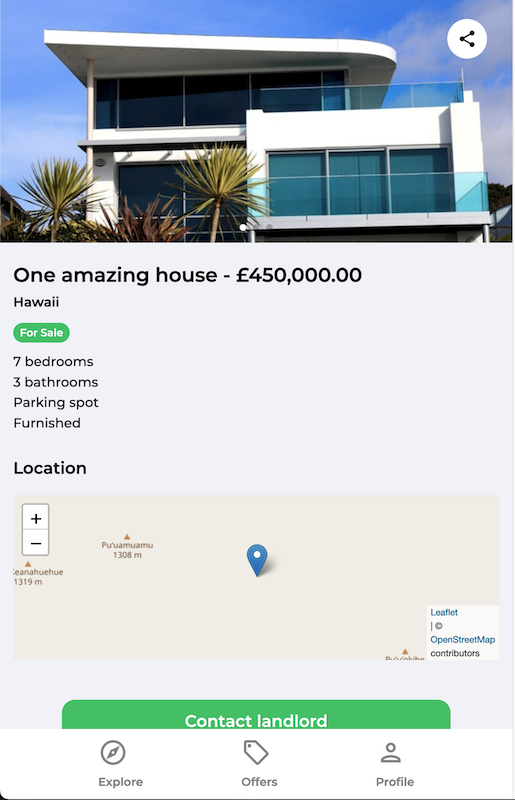

# React home market project

Practicing api-s and firebase.

# Created at

April 12, 2022

# Project is created with

- React
- Firebase
- Google clouds
- Swiper
- leaflet
- react-toastify
- uuid
- CSS

# View on browser

## [https://mern-project-q3n3aj1wv-n00bg1rl.vercel.app/](https://mern-project-q3n3aj1wv-n00bg1rl.vercel.app/)

# View as image

# Getting Started with Create React App

This project was bootstrapped with [Create React App](https://github.com/facebook/create-react-app).

## Available Scripts

In the project directory, you can run:

### `npm install`

### `npm start`

Runs the app in the development mode.\
Open [http://localhost:3000](http://localhost:3000) to view it in your browser.

The page will reload when you make changes.\
You may also see any lint errors in the console.
